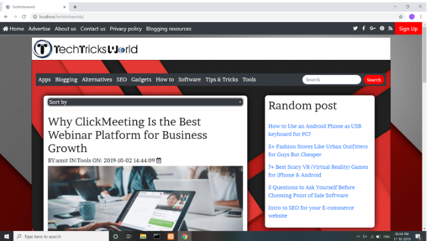
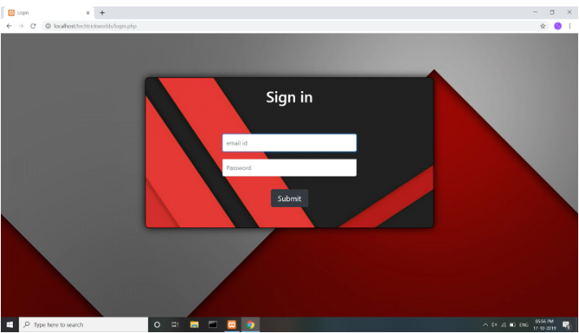
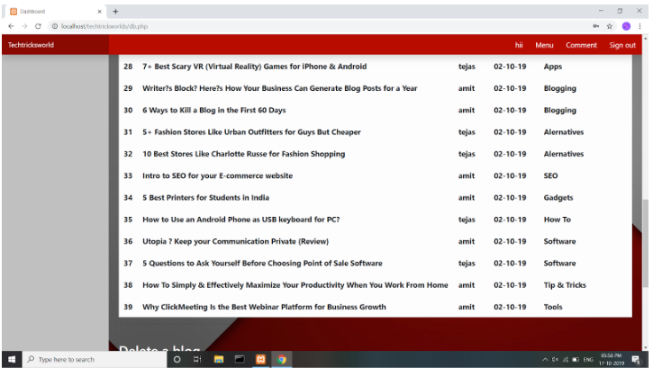
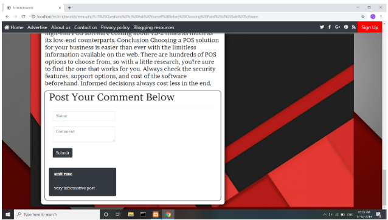

# Blogging-website - clone of techtricksworld website

The file name"techtricksworld.sql"is the database of the website.

rest all the files must be saved in same folder named "techtricksworlds". 

index.php is the main home page.

the database name should be "techtricksworld" and all the tables should be imported inside it.

This project is the  project developed by amit , tejas and ankit together as a team members. To run this prerequisites are: xampp server and computer with internet connection

Initially we need to index.php file to get homepage for the site Then we have a login and registration for the user The user can  view all the post and add a comment.

Then on visiting /db.php we will have a login page for the admin where admin can write the post ,update it or delete it.

This is the community driven website and also needs further development to make a full fledged blog/aritcle website.

the admin id and password are 

email: amitrane138@gmail.com  login: amit password: 	amit123

email: tejasmaheshkachare@gmail.com login: tejas password: tejas123

